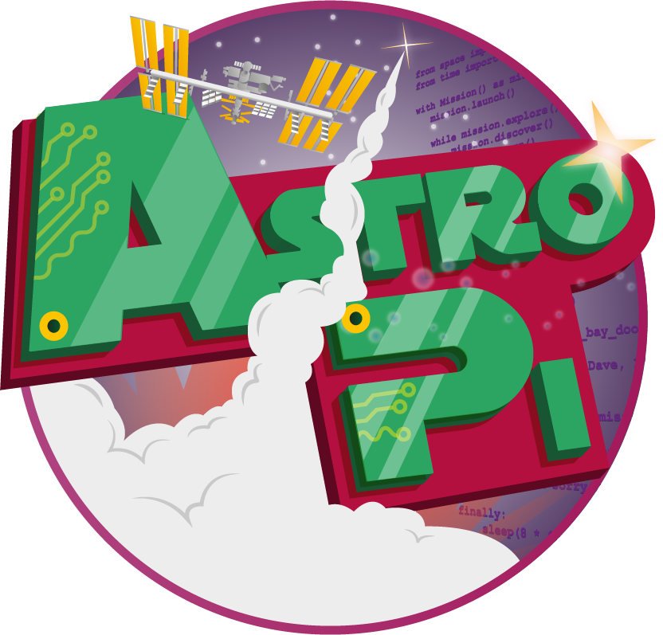
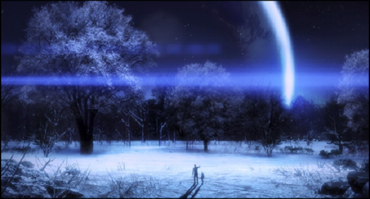

# 🎉 Round 3

---

## This year Ireland legalized same-sex marriage by popular vote. What month was the vote?
## Bonus: what was the full date?

---

# May

## May 23, 2015

---

# Name the four named storms that hit Ireland this year.

## (1 point each)

---

## Abigail
## Barney
## Clodagh
## Desmond

---

# This year NASA announced they discovered something on Mars, what was it?

---

# Water
## [fit] Matt Damon also an acceptable answer

---

## This week the International Space Station resupply mission was notable for including which popular computer?

---

# The Raspberry Pi
## Astro Pi

---

# Name the voice actor for Stargazer in Mass Effect 3

---

# Buzz Aldrin

---

## On this day (December 10) in 1815 the person dubbed the world’s first computer programmer was born, what was their name?

---

# Ada Lovelace

## [fit] The Honourable Ada Byron 
## [fit] The Right Honourable The Lady King 
## [fit] The Right Honourable The Countess of Lovelace

---

# Can you tell us how much a burger cost at this year's Web Summit?

---

# €20

---

## Name the musical comedy miniseries that starred Felicia Day, Nathan Fillion and Neil Patrick Harris

---

# Dr. Horrible's Sing-Along Blog

---

# What does the red mushroom do in Super Mario?

---

# Mario grows in size and becomes Super Mario

---

## Name the terrible 1980s video game, whose cartridges were recently unearthed in a New Mexico landfill

---

# E.T. the Extra-Terrestrial

---

# Round 3 Finished
