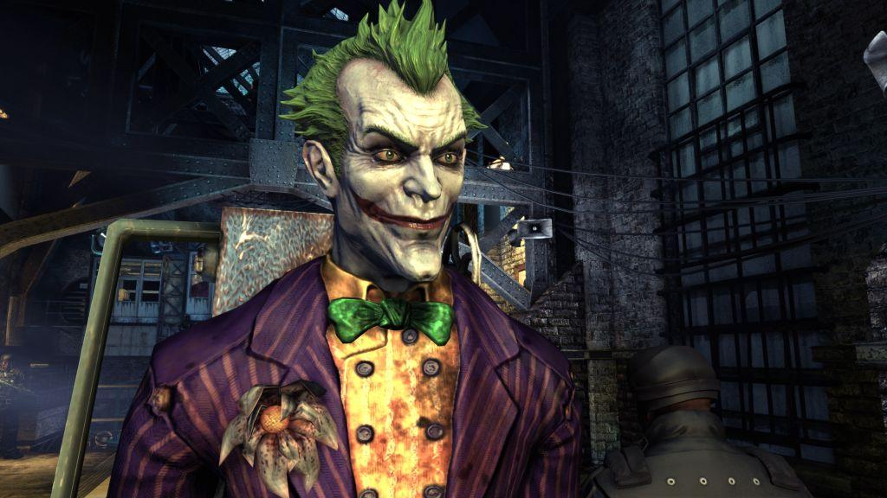
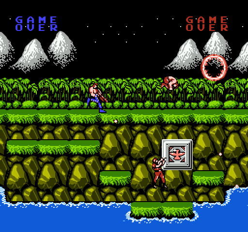
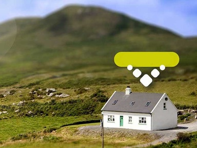

# The Night Before Quizmas

---

# 🎄 Round 1

---

# Name the first programmer of the Mark I computer, an electro-mechanical computer.

---

# What does ENIAC stand for?

---

# Who invented Python?

---

# Who invented Ruby?

---

# Who invented Perl?

---

# Who invented F#?

---

# Who invented Javascript?

---

# Who invented Scala?

---

# Round 1 Finished

---

# 🎅 Round 2

---

# What does HTTP stand for?

---

# Name Apple’s new programming language

---

## The Bootstrap web development framework was originally developed by employees of which social networking company?

---

## Name the whistleblower who exposed the NSA’s secret program to access the servers of Microsoft, Google and other tech giants.

---

## Name the voice actor for Joker in Batman: Arkham Asylum

---

# What is the Konami Code?

---

# Which car manufacturer was caught cheating in emission testing?

---

# Name the second longest river in Ireland

---

# Name the RTE reporter who shot to fame for their weather reporting?

---

## Name the new Irish national postcode system which was launched earlier this year
### Bonus: Can you write down your full postal code using this system?

---

# Round 2 Finished

---

# 🎉 Round 3

---

## This year Ireland legalized same-sex marriage by popular vote. What month was the vote?
## Bonus: what was the full date?

---

# Name the four named storms that hit Ireland this year.

## (1 point each)

---

# This year NASA announced they discovered something on Mars, what was it?

---

## This week the International Space Station resupply mission was notable for including which popular computer?

---

# Name the voice actor for Stargazer in Mass Effect 3

---

## On this day (December 10) in 1815 the person dubbed the world’s first computer programmer was born, what was their name?

---

# Can you tell us how much a burger cost at this year's Web Summit?

---

## Name the musical comedy miniseries that starred Felicia Day, Nathan Fillion and Neil Patrick Harris

---

# What does the red mushroom do in Super Mario?

---

## Name the terrible 1980s video game, whose cartridges were recently unearthed in a New Mexico landfill

---

# Round 3 Finished
