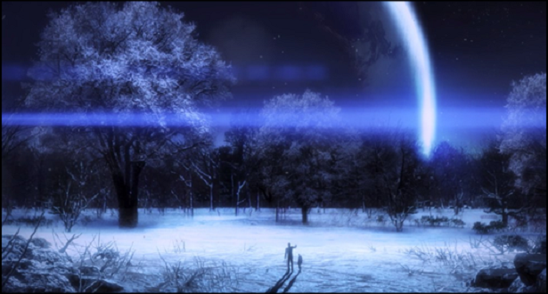

# 🎉 Round 3

---

## This year Ireland legalized same-sex marriage by popular vote. What month was the vote?
## Bonus: what was the full date?

---

# Name the four named storms that hit Ireland this year.

## (1 point each)

---

# This year NASA announced they discovered something on Mars, what was it?

---

## This week the International Space Station resupply mission was notable for including which popular computer?

---

# Name the voice actor for Stargazer in Mass Effect 3

---

## On this day (December 10) in 1815 the person dubbed the world’s first computer programmer was born, what was their name?

---

# Can you tell us how much a burger cost at this year's Web Summit?

---

## Name the musical comedy miniseries that starred Felicia Day, Nathan Fillion and Neil Patrick Harris

---

# What does the red mushroom do in Super Mario?

---

## Name the terrible 1980s video game, whose cartridges were recently unearthed in a New Mexico landfill

---

# Round 3 Finished
